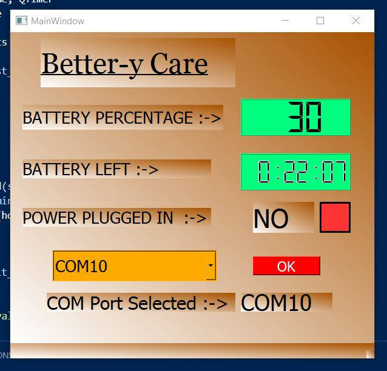
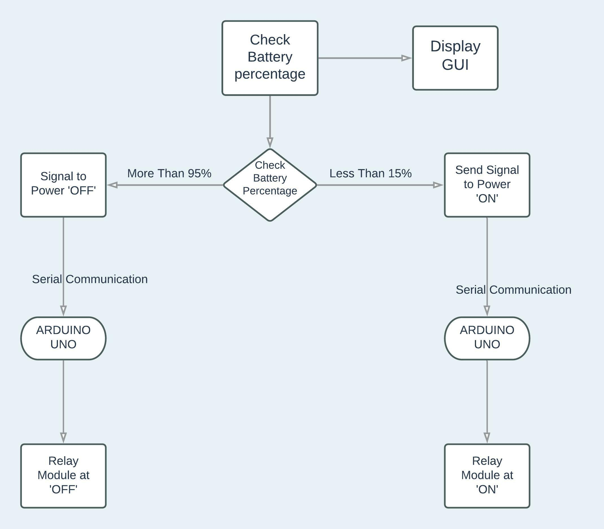
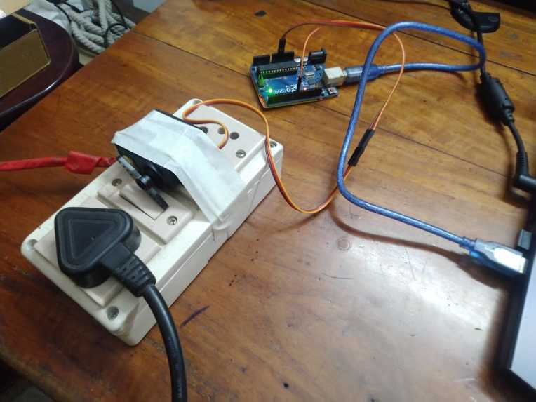
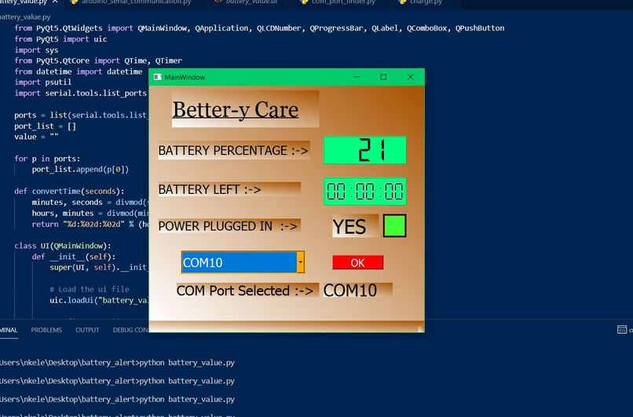

# Better-y Care - Automated Laptop Charge Monitor

##  A software that monitors the battery stats of a laptop. It also automatically controls the switch of the power plug for charging the laptop battery. 

## Software Used
- Python
- Pyserial
- PyQt5 -> For GUI
- imutils

## Hardware used 
- Arduino UNO
- Servo Motor
- 5V Relay 

# Inspiration

I often work on problems related to computer vision and deep learning. It means that I need to train deep learning models on our own dataset. Training a model requires hours of time, sometimes even more than a day. So I need to constantly keep an eye on our laptop's battery percentage. If the battery is too low, it will switch off and I will lose hours of progress. So I decided to automate this process of switching ON or OFF the power plug depending on the battery percentage.

# Workflow

### The system consists of both software and hardware part.

The **software** part is the GUI made using PyQt5 in Python which collects details of the laptop battery using the 'imutils' package. It then displays the battery percentage, time left on current battery percentage, and whether the power is plugged in or not.

The **hardware** part is responsible for switching ON or OFF the power plug. It receives the signal from the Python program through serial communication. Due to non-availability of relay module at the moment, I used a servo motor forturning the switch ON and OFF. Depending on the battery percentage, the swich can be turned ON or OFF.

 

If the battery is less than 15% , the software would send a signal through serial communication to switch 'ON' the power plug. Once the battery power percentage reaches more than 95%, it would send a signal to the arduino board to turn off the power plug.

# How we built it

We used an Arduino UNO and a servo motor for controlling the power plug's power as ON or OFF. The python code displays the Battery percentage, time left on battery percentage and whether the power plug is switched ON or OFF. We used serial communication protocol for communicating between the Python program and the Arduino UNO board. 

The GUI Window is made using **PyQt5** in Python. It displays the following :

    - Battery Percentage Left
    - Time left on Battery
    - Power Plugged Status (YES/NO)
    - Selected COM Port
    - Dropdown for COM Port Selection

## Demo Video 
[Better-y Care - Automated Laptop Charge Monitor ](https://youtu.be/Gslyyzvvda4)

## Project Page
[Better-y Care - Automated Laptop Charge Monitor](https://devpost.com/software/better-y-care-automated-laptop-charge-monitor)

## Built By 
- [Nilutpol Kashyap](https://github.com/nilutpolkashyap)
- [Priyanka Kashyap](https://github.com/thepriyankakashyap)

